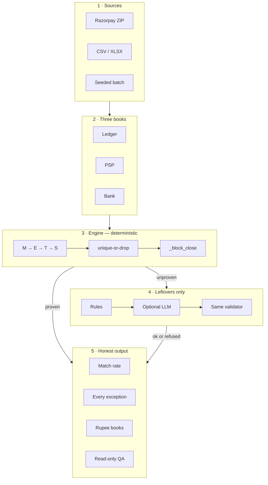

# AI Finance Controller

Razorpay AI Buildathon 2026 — Track 04.

Three books should agree: **your ledger**, **Razorpay (the PSP)**, and **the bank**. This agent reads a 50+ row batch — including Razorpay payouts that bundle many payments into one NEFT — and closes every cash loop it can *prove*. Then it prints the match rate, lists every leftover with a reason, and shows the same batch in rupees.

A **close** is one proven loop (ledger + PSP + bank). If two rows could both be the match, both stay open. An optional LLM may *suggest* a leftover; it cannot book cash.

> In finance, a wrong match is worse than no match.



The model never sits on the close path. A suggestion that fails `_block_close` stays an exception.

## Run it (no API key)

```bash
python3 -m venv .venv
source .venv/bin/activate
pip install -e ".[dev]"
./verify.sh
```

That runs the tests and checks that the published figures in `fixtures/published_metrics.json` have not drifted. Non-zero exit if a number moved.

Then pick one:

```bash
./scripts/demo.sh                          # Razorpay recon ZIP → report.json
cd dashboard && npm install && npm run dev # upload fixtures/razorpay_sample/batch.zip
python -m finance_controller.qa "how much money is stuck?" --report report.json
```

Q&A reads a frozen `report.json`. It cannot change a match, amount, or status.

## What the numbers mean

Match **rate** = closed ÷ (closed + leftover). It is supposed to fall when the file is full of real breaks. **Detection F1** is the other number: labeled exceptions were neither missed nor invented.

| Batch | Closed | Open | Match rate | Detection P / R / F1 |
| --- | --- | --- | --- | --- |
| Razorpay Settlement Recon ZIP | 50 | 7 | **87.72%** | 1.0 / 1.0 / 1.0 |
| CSV dump | 47 | 10 | 82.46% | 1.0 / 1.0 / 1.0 |
| Seed 42 · 80 payments + injected edges | 56 | 23 | **70.89%** | 1.0 / 1.0 / 1.0 |
| Seed 42 · 1,000 payments · **same 12+6+16 inject** | 973 | 23 | **97.69%** | 1.0 / 1.0 / 1.0 |

The 97.69% run has the **same 23 leftovers** as the 80-payment run. The rate went up because 920 extra payments were clean. A headline auto-match rate mostly measures how many breaks you planted, not how good the matcher is.

False closes of labeled exceptions: **0**. False misses: **0**. Pinned on eight seeds (50–200 records) and on the 1,000-payment run.

Throughput, engine only, this laptop: ~4,500 rows/s at 80 payments, ~400 at 1,000, ~200 at 2,000. Worse than linear. Not a capacity guarantee.

### Same ZIP, in rupees (the 87.72% run)

Record counts treat a ₹200 timing break and a ₹5,000 amount break as one each. Rupees are the queue to work.

| Bucket | INR |
| --- | --- |
| Settled in bank | 57,354.03 |
| Blocked on 7 exceptions | 5,553.22 |
| Expected, not credited | 1,409.48 |
| Bank unmatched | 3,830.32 |
| Ledger expected vs bank credited | 64,293.54 vs 61,184.35 (variance 3,109.19) |
| Forward — due inside lag window | 4,882.17 |
| Forward — stuck past window | 671.05 |

Forward cash uses the configured banking-day lag. `as_of` is the latest date in the file, not wall-clock today.

## How a row gets closed

Razorpay already prints `settlement_id` on every recon line. We group on that — we do **not** subset-sum a naked bank credit against every combination of payments. Amount-only search is how two unrelated ₹10,000 settlements on the same day become a false match.

| Step | What it does |
| --- | --- |
| **M** many-to-one | Many PSP/ledger lines → one bank NEFT, grouped by `settlement_id` |
| **E** exact | Unique UTR / reference / payee+amount |
| **T** tolerant | Fee and banking-day slack, still unique-or-drop |
| **S** one-to-many | One booking split across several bank credits |
| Gates | GST (half-up 18% of MDR ± ₹0.05), date, amount, UTR, status — `_block_close` |
| Investigator | Rules first; optional LLM on leftovers only |
| Validator | Same `_block_close` gates. Ambiguous completions refused |
| Exceptions | Anything unproven stays on the list. Never auto-passed |

Importing the engine does not load the agent package. A model `reconcile` that fails the validator stays open. LLM timeout is 12s; then rules finish every leftover.

## What you can feed it

An **adapter**, not a live payout API. Maps Settlement Recon columns (`GET /v1/settlements/recon/combined`) onto ledger / PSP / bank. No Razorpay keys. `--razorpay-live` without keys uses the same fixture and never calls the network.

| Razorpay field | Becomes |
| --- | --- |
| `entity_id` / `payment_id` | ledger `payment_id` |
| `amount` (paise) | ledger / PSP gross |
| `fee` + `tax` | PSP MDR + GST |
| `credit` − `debit` | one NEFT per `settlement_id` |
| `settlement_id` | batch grouping |
| `settlement_utr` | bank narration — not the primary join key |
| `type=adjustment\|transfer` | skipped with a warning (not silent) |

```bash
# shipped Razorpay ZIP
python -m finance_controller.cli --razorpay-zip fixtures/razorpay_sample/batch.zip --no-llm --out report

# CSV folder
python -m finance_controller.cli --data-dir fixtures/finance_synthetic_data --no-llm --out report

# generated batch (reproducible seed)
python -m finance_controller.cli --seed 42 --num-records 80 --inject-exceptions 12 --inject-resolvable 6 --inject-edges 16 --out report

# fail the process if detection F1 drops
python -m finance_controller.cli --razorpay-zip fixtures/razorpay_sample/batch.zip --no-llm --fail-under 1.0 --out report
```

`--no-llm` or dashboard `?useLlm=0` is rules only.

## Dashboard, history, Q&A

- **Dashboard** — ZIP upload, rupee books, leftovers, notes, aging.
- **SQLite** — run history and an append-only audit trail (`data/finance_controller.db`). Amounts as decimal text. `UPDATE`/`DELETE` on `audit_events` is rejected by triggers. Pytest uses a temp file.
- **Q&A** — `python -m finance_controller.qa "…"` over `report.json`. Mutation phrasing is refused.

## API key (optional)

Copy `.env.example` to `.env`, paste **one** block, replace `PASTE_HERE`. Without a key, rules still run. `.env` is gitignored.

Gemini:

```
LLM_PROVIDER=gemini
GEMINI_API_KEY=PASTE_HERE
GEMINI_MODEL=gemini-3.6-flash
```

OpenAI:

```
LLM_PROVIDER=openai
OPENAI_API_KEY=PASTE_HERE
OPENAI_MODEL=gpt-4o-mini
```

Claude:

```
LLM_PROVIDER=claude
ANTHROPIC_API_KEY=PASTE_HERE
CLAUDE_MODEL=claude-sonnet-4-6
```

GLM (OpenRouter):

```
LLM_PROVIDER=glm
OPENROUTER_API_KEY=PASTE_HERE
GLM_MODEL=z-ai/glm-5.2
```

GLM (Z.ai):

```
LLM_PROVIDER=glm
ZAI_API_KEY=PASTE_HERE
GLM_MODEL=glm-5.2
```

## What it does not do

- **N:1 is labelled.** We group on `settlement_id`. We do not decompose a naked NEFT, and we do not net in-batch refunds out of a payout.
- **TDS (s.194-O / 393) is not modelled.** GST is half-up 18% of MDR ± ₹0.05. Bankers rounding is not a second legal value.
- **FX** is an exception type, not a live FX book.
- **Ground truth is generated with the data** (or shipped next to the fixture). F1 = 1.0 means we match those labels.
- **Razorpay ZIP uses real column names and synthetic rows.**
- **Throughput is one laptop, not a SLA.**

Deeper: `ARCHITECTURE.md` (matching contract), `FAILURE_LOG.md` (defects we found in our own gates and docs, including the 97% density trick).

```bash
pytest
```
